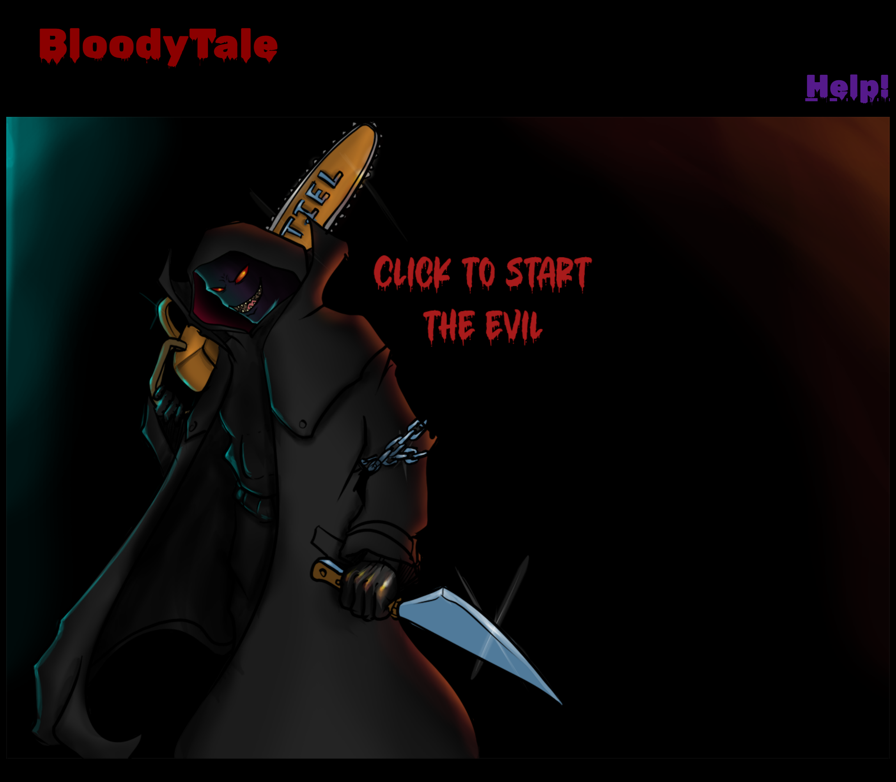

# BloodTale_AMurderMystery
Welcome to the chilling tale of an investigator trying to save themselves from being hunted by solving the identity of the killer.
The point of the game is that a Serial killer is coming after you and you will have to find out who he is based on the clues he provides. Each day will present you with a new clue and a new puzzle then by the last day you are tasked with inputting the killers name into a prompt to survive or you die. Ill start off with a demo of the first day.


## Description
```
AS A User who loves true crime
I WANT a game that i can engage with with atmospheric tones of a serial killer
THEN that game will have me engage in serial killer trivia
THEN will have me solve a puzzle.
I WANT the experience to be thematic and aimed at me.
I WANT the elements to be dynamic, using varied web tools to create the engagement
I WANT  to learn about true crime stories
IN A fun environment

```
## Collaboration
https://github.com/renansm93
https://github.com/MarcoSaverino
https://github.com/MVROZAY
https://github.com/rethissunstar


## How to Install
please click the pic or vist the alternate
alternaively: https://rethissunstar.github.io/BloodTale_AMurderMystery/

## Live URL




## Resources
https://www.jqueryscript.net/text/jQuery-Plugin-To-Create-Pretty-Chat-Bubbles-chatbubble-js.html#google_vignette
written by Quadrophone

Images for phone and the comic book style image are created by Christopher Rodrigues
https://github.com/rethissunstar

Fonts from Google Font's API

https://pixabay.com/music/suspense-dark-mystery-trailer-taking-our-time-131566/

https://github.com/rethissunstar/BloodTale_AMurderMystery

## Done under the MIT license
